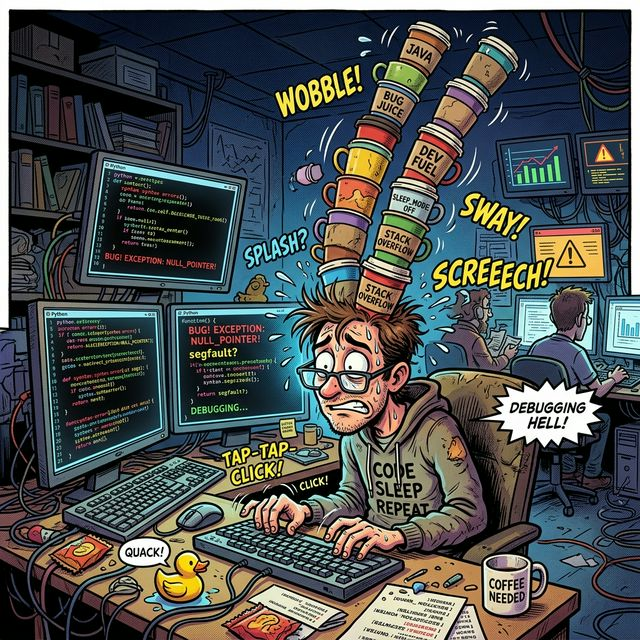

# 🚀 Tutorial Funny: Panduan Bertahan Hidup di Dunia Coding
Selamat datang di repositori yang probabilitasnya kecil untuk menyelamatkan karir Anda, tapi setidaknya bisa bikin senyum sedikit pas lagi dapat error 500. Repo ini berisi dokumentasi absurd yang dibuat khusus agar Anda tetap waras saat ngoding.

---

## 1. Persiapan Mental Sebelum Ngoding 🧠

*Gambar 1: Muka kamu saat pertama kali merasa sok jago setelah ngetik `print("Hello World")` di terminal.*

Sebelum kamu menyentuh keyboard, ada beberapa hal yang wajib dipersiapkan:
- **Tarik napas panjang:** Karena sebentar lagi kamu akan banyak menghela napas.
- **Kosongkan pikiran:** Karena kode kamu yang kemaren aja hari ini udah kerasa asing.
- **Beli cermin:** Buat nanya ke diri sendiri, *"Kenapa aku memilih profesi ini?"*


**Pro Tip:** Jangan pernah bilang "Ah, ini gampang, 5 menit beres." Itu adalah mantra pemanggil kutukan bug abadi yang akan memakan waktu weekend kamu.


---

## 2. Kopi: Cairan Suci Para Dev ☕

*Gambar 2: Gambaran visual dari mencoba menambal memori leak dengan asupan kafein.*

Kopi bukan sekadar minuman, melainkan pelumas otak. Dalam hierarki kebutuhan programmer, kopi posisinya ada di atas validasi JSON. 

1. **Stack Overflow & Chill:** Sebelum pusing milih metode, pusinglah dulu milih biji kopi.
2. **Kopi Hitam:** Untuk mengatasi backend yang meledak.
3. **Kopi Susu Gula Aren:** Untuk merancang UI/UX yang manis tapi fana.
4. **Air Putih:** Jangan lupa minum air putih, ginjal kamu nggak bisa di-restart pakai `systemctl restart ginjal`.

---

## 3. Kamus Bahasa Programmer Pemula 📖

Di dunia ini, kata-kata memiliki makna ganda. Mari kita bedah beberapa istilah kramat:

* **"Di lokal saya jalan kok!"**
  > Artinya: "Saya juga nggak tau kenapa di server hancur lebur, tolong jangan marahin saya."

* **"Tinggal sedikit lagi kelar."**
  > Artinya: "Saya baru bikin folder project-nya."

* **"Itu bukan bug, itu fitur."**
  > Artinya: "Saya malas benerinnya, terima nasib aja ya klien."

* **"Ntar saya refactor kodenya."**
  > Artinya: "Kode ini akan tetap busuk dan berantakan sampai project ini ditinggalkan."

---

## 4. Cara Menghindari Burnout (Dijamin Gagal) 🔥

1. **Jalan-jalan di alam:** Setelah 30 menit menatap pohon, kamu akan sadar kalau pohon itu strukturnya mirip *binary tree* dan kamu mulai memikirkan DFS (*Depth-First Search*) di kepala.
2. **Main game:** Buka game, lihat bug visual, mikir "Wah ini pasti developer-nya salah nge-set collider-nya." Gagal santai.
3. **Tidur nyenyak:** Mimpi dikejar oleh monster berbentuk `NullPointerException`. Sangat menyegarkan.


**Kesimpulan:** Terima saja nasib. Nikmati setiap detik penderitaan saat *debugging*, karena pada akhirnya, rasa puas saat kode berhasil jalan tanpa error adalah validasi hidup terbaik.


Jaga kesehatan, jangan lupa save kode, dan selamat ngoding! 💻✨